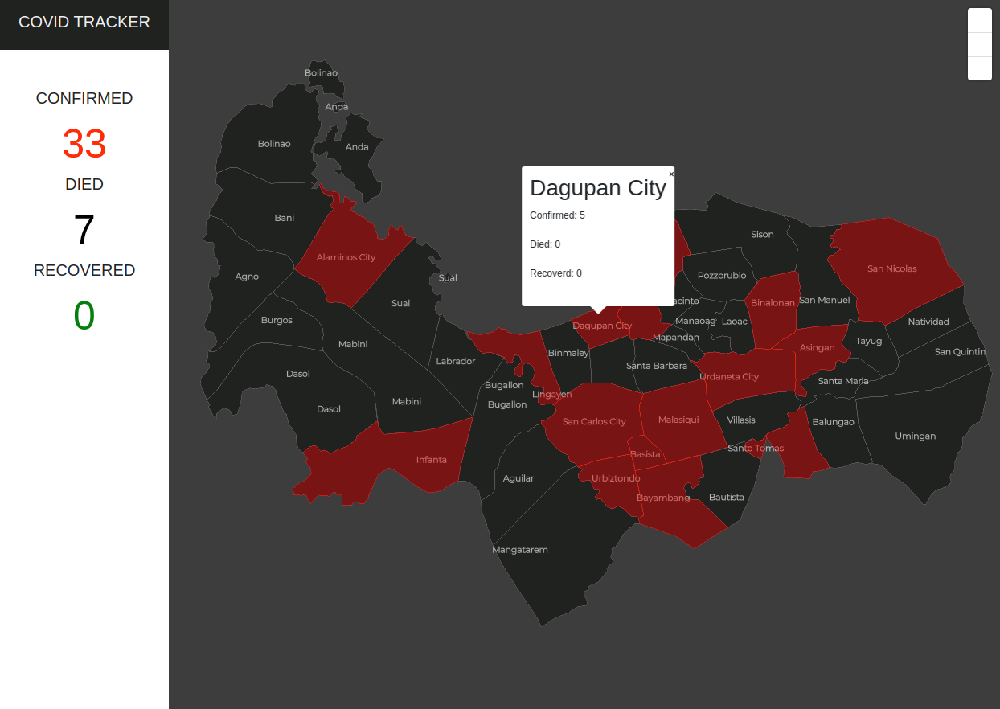

# PCT - Pangasinan Coronavirus(COVID-19) Tracker
The concept of this application is to display the statistics of Coronavirus(COVID-19) in the local provice of Pangasinan and data are being collected form (https://ncovtracker.doh.gov.ph/).

### Tech Overview
This application is developed using Mongo, Express, Angular and Node (MEAN) Stack. Mapbox to populate the coordinates on the map using GeoJson format.



### Installation

- Clone this repo

`git clone https://github.com/egiev/pct.git`

- Enter project directory

`cd pct`

- You must have mongodb installed in your machine and run this command

`mongod`

### Running the server

````````````````````
cd server
npm install
npm run server
````````````````````

### Running the client
You must have Angular installed in your machine
````````````````````
cd client
npm install
ng serve
````````````````````
- Visit http://localhost:4200/ to see the result

### Resources
- GeoJson - generating geojson (https://github.com/faeldon/philippines-json-maps)
- Mapbox - for styling the map (https://www.mapbox.com/)
